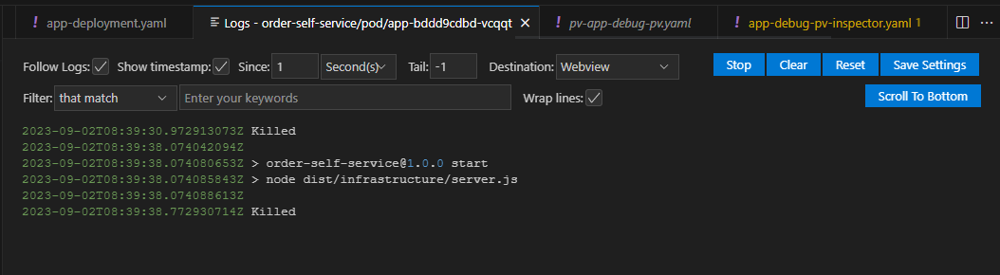

# Fase 02 - Artefatos de entrega

Para os examinadores do projeto, peço que vejam a sessão [Considerações finais e Avisos aos professores](#considerações-finais-e-avisos-aos-professores).

## Deploy Kubernetes

Para o deploys das aplicações criamos 2 deploys.

1- Aplicação - [API Self Order](https://github.com/colantuomo/order-self-service-api)

2- Banco de dados da aplicação - Postgres

### Arquivos yaml - Namespace

Para isolar o projeto de outras Namespaces criamos a namespace `order-self-service` e aplicamos nas configurações para que obedecessem essa configuração. 

Para rodar a criação do namespace rodar o comando abaixo:

```bash
kubectl apply -f namespace.yaml
```

No final do arquivo encontram-se os comandos para serem rodados em ordem.

### Arquivos yaml - Aplicação

1- `app-deployment`: Arquivo principal do Deploy do projeto.

Configuramos o Deploy da aplicação para gerar 2 réplicas do projeto.

A imagem está no DockerHub sob a conta do [willkazahaya](https://hub.docker.com/repository/docker/willkazahaya/order-self-service/general).

O deploy da aplicação utiliza o arquivo de `ConfigMap` (app-configmap-env) para definir a conexão com o banco de dados, a API do mercado pago e a porta que o projeto irá subir. Assim como tambem conta com o arquivo `Secret` (app-secret) que contem o token para a integração do MercadoPago encriptografado em Base64.

2- `app-service`: Para disponibilizar o projeto utilizamos um Service do tipo ClusterIP que disponibiliza a porta 8080 para uso, vinculando à porta 8080

### Arquivos yaml - Banco de Dados

1- `database-persistent-volume`: Começamos gerando o Volume de 2GB para o Banco para que os dados fossem persistidos

2- `database-persistent-volume-claim`: Vinculamos o volume para poder utilizar no Deploy do banco de dados

3- `database-deployment`: No arquivo do deployment definimos uma unica réplica, disponibilizando a porta `5432`. O deploy contem o arquivo de `ConfigMap` e `Secrets` utilizado

Obs: Caso queira acessar o banco via Dbeaver ou outro Client de Banco de dados rode:

```
kubectl port-forward svc/database-service 5432:5432
```

O banco criado é `fiap` e o usuário e senha encontra-se criptografado no arquivo `database-secret.yaml` em `Base64`.

### Considerações finais e Avisos aos professores.

A parte da configuração do Database está rodando e está funcionando corretamente, criando o Banco de dados que utilizamos no app. 

Porem do lado do App não conseguimos subir o Pod... E fizemos vários ajustes, mas sempre que vemos o Pod surge a imagem abaixo:



Tentamos usar o Describe, olhar os Logs, mas não há uma mensagem que explique o problema... Até subimos a aplicação em um Pod separado e ele não "capota".

Acreditamos que o problema talvez seja na URL para conexão do Banco, mas não conseguimos avaliar isso antes de estourar o tempo de entrega... 

Se tiverem qualquer dica de como resolver este problema, iremos agradecer imensamente.

## Ordem de execução
### Namespace
```
kubectl apply -f namespace.yaml
```
### Configs
```
kubectl apply -f app-configmap-env.yaml
kubectl apply -f app-secret.yaml
kubectl apply -f database-configmap-env.yaml
kubectl apply -f database-secret.yaml
```
### Volumes - Database
```
kubectl apply -f database-persistent-volume.yaml
kubectl apply -f database-persistent-volume-claim.yaml
```
### Deployment - Database
```
kubectl apply -f database-deployment.yaml
```
### Service - Database
```
kubectl apply -f database-service.yaml
```
### Deployment - App
```
kubectl apply -f app-deployment.yaml
```
### Service - Database
```
kubectl apply -f app-service.yaml
```

## Links
* [Aplicação](https://github.com/colantuomo/order-self-service-api)
* [DockerHub](https://hub.docker.com/repository/docker/willkazahaya/order-self-service/general)

## Contributors

* Denis Wesley Slapelis - rm348515
* Paulo César Colantuomo Martins - rm349043
* Willian Yoshiaki Kazahaya - rm348581

